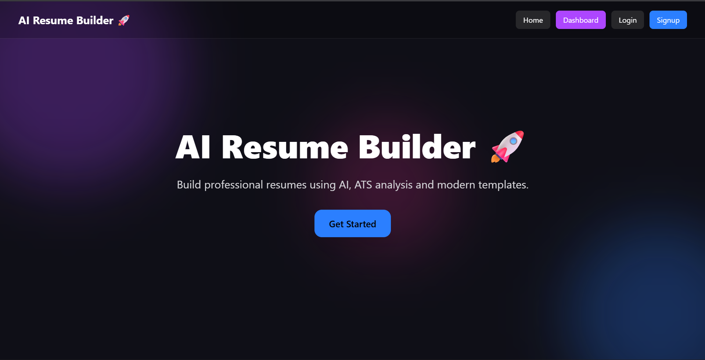
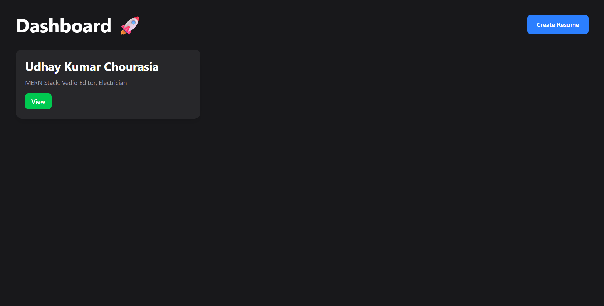

# 🚀 AI Resume Builder

AI-powered Resume Builder built using MERN Stack with ATS-friendly resume creation, dashboard management, and modern UI.

---

## 🌐 Live Demo

🔗 https://ai-resume-builder-xi-bay.vercel.app/#

---

## ✨ Features

✅ User Authentication  
✅ AI Resume Generation  
✅ Create Resume  
✅ Edit Resume  
✅ Delete Resume  
✅ Dashboard Management  
✅ Responsive UI  
✅ Modern Design  
✅ MongoDB Database Integration  

---

## 🛠️ Tech Stack

### Frontend
- React.js
- Vite
- Tailwind CSS
- Axios
- React Router

### Backend
- Node.js
- Express.js
- MongoDB
- Mongoose
- JWT Authentication

---

## 📸 Screenshots

(Add screenshots here)

Example:





---

## ⚙️ Installation

### Clone Repository

```bash
git clone https://github.com/Udaychourasia/AI-resume-builder.git
